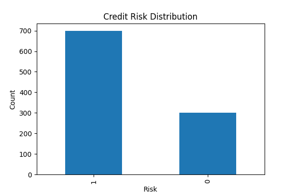
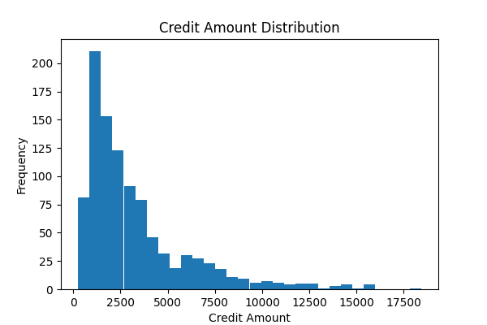
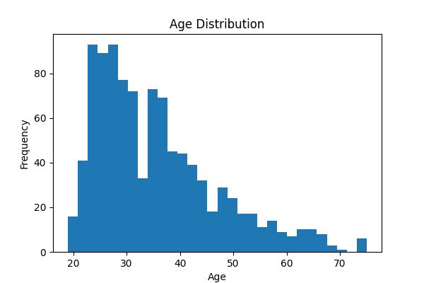
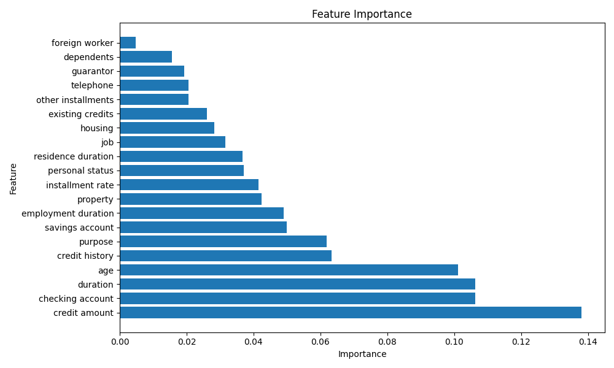

# Credit Risk Scoring System Using Machine Learning

## Overview

This project predicts applicant credit risk using machine learning techniques and the German Credit Dataset.

The objective is to assist financial institutions in assessing loan applicants by identifying patterns associated with creditworthiness and repayment risk.

---

## Dataset

* German Credit Dataset
* 1000 applicant records
* 20 input features
* 1 target variable (Credit Risk)

Features include:

* Checking Account Status
* Credit History
* Credit Amount
* Loan Duration
* Savings Account Status
* Employment Duration
* Age
* Housing
* Existing Credits

---

## Project Workflow

1. Data Loading and Cleaning
2. Exploratory Data Analysis (EDA)
3. Train-Test Split
4. Logistic Regression Model
5. Random Forest Model
6. Model Comparison
7. Feature Importance Analysis
8. Business Insights

---

## Models Used

### Logistic Regression

Accuracy: **75.0%**

### Random Forest

Accuracy: **73.5%**

Logistic Regression achieved slightly better performance and was selected as the preferred model.

---

## Key Findings

The most influential features affecting credit risk were:

1. Credit Amount
2. Checking Account Status
3. Loan Duration
4. Age
5. Credit History

These findings align with real-world banking practices where lenders evaluate financial stability, repayment history, and loan characteristics before approving credit.

---

## Results

### Credit Risk Distribution



### Credit Amount Distribution



### Age Distribution



### Feature Importance



---

## Technologies Used

* Python
* Pandas
* NumPy
* Matplotlib
* Scikit-learn
* Google Colab

---

## Repository Structure

```text
credit-risk-scoring-system/

├── data/
├── notebooks/
├── results/
├── docs/
├── README.md
└── requirements.txt
```

---

## Business Impact

This project demonstrates how machine learning can support:

* Credit Risk Assessment
* Loan Approval Decisions
* Risk Segmentation
* Portfolio Quality Improvement
* Financial Decision-Making

---

## Future Improvements

* Handle class imbalance using SMOTE
* Hyperparameter tuning
* ROC-AUC analysis
* Gradient Boosting and XGBoost models
* Web application deployment

```
```
